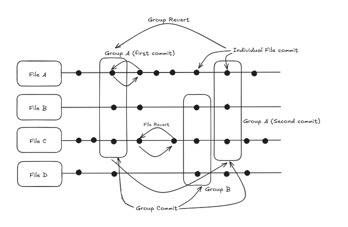

<div align="center">
  
</div>

# qwe (kiwi) - lightweight, flexible, file-first version/revision control system


**qwe** (pronounced *kiwi*) makes version control effortless.
Track individual files with precision, group them seamlessly, and commit or revert changes individually or together — all in one lightweight, intuitive tool built for speed and simplicity.

)   

 

## Features

- **File-based version control** — track versions of specific files independently.  
- **Easy commits** — record changes with a simple commit message.  
- **Revert anytime** — roll back a single file without affecting others.  
- **Grouped snapshot** — Track multiple files with ease for collective commit and revert.
- **Simple and fast** — minimal setup, no complex repository management.

## How does it work?

`qwe` allows you to track individual files separately or bundle related files into a single, named snapshot for easy tracking and rollback.

**Group Creation:** Create a logical group (e.g., "Project X Assets," "Configuration Files") that contains multiple individual files.

**Unified Tracking:** When you take a snapshot of the group, qwe captures the current state of all files within it. This makes rolling back a set of related changes incredibly simple.

<div align="center">
  
</div>

A key design choice in qwe is the persistence of file-level tracking, even within a group. This gives you unparalleled flexibility.

Example: Imagine you are tracking files A, B, and C in a group called "Feature-A." You still have the freedom to commit an independent revision for file A alone without affecting the group's snapshot history for B and C.

This means you can:

- Maintain a clean, unified history for all files in the group (the Group Snapshot).
- Still perform granular, single-file rollbacks or commits outside the group's scope.

This approach ensures that qwe remains the flexible, non-intrusive file revision system that you can rely on.

## Installation

You can install **qwe** in two ways:

### 1️⃣ Using Go Package Manager
```bash
go install github.com/mainak55512/qwe@latest
```

Make sure your Go environment’s `GOPATH/bin` is added to your system `PATH`.

### 2️⃣ Using Prebuilt Executables
Download the prebuilt binary for your platform from the **[Releases](https://github.com/mainak55512/qwe/releases)** section of this repository and add it to your PATH.


## Commands

| Command | Description |
|----------|-------------|
| `qwe` | Shows all the available commands |
| `qwe init` | Initialize qwe in the current directory |
| `qwe group-init <group name>` | Initialize a group in the current directory |
| `qwe track <file-path>` | Start tracking a file |
| `qwe group-track <group name> <file-path>` | Start tracking a file in a group |
| `qwe list <file-path>` | List all commits for the specified file |
| `qwe group-list <group name>` | List all commits for the specified group |
| `qwe commit <file-path> "<commit message>"` | Commit changes to the file with a message |
| `qwe group-commit <group name> "<commit message>"` | Commit changes of all the files tracked in the group with a message |
| `qwe revert <file-path>` | Revert the file to the last committed version |
| `qwe revert <file-path> <commit-id>` | Revert the file to a previous version |
| `qwe group-revert <group name> <commit-id>` | Revert the files tracked in the group to a previous version |
| `qwe current <file-path>` | Shows current commit details of the specified file |
| `qwe group-current <file-path>` | Shows current commit details of the specified group |
| `qwe rebase <file-path>` | Revert file to its base version |
| `qwe diff <file-path>` | Shows latest uncommitted and last committed version diff |
| `qwe diff <file-path> <commit_id_1> <commit_id_2>` | Shows version diff of commit_id_1 & commit_id_2|
| `qwe diff <file-path> uncommitted <commit_id>` | Shows version diff of latest uncommitted version and commit_id version|


## Example Usage

*Tracking single file*
```bash
qwe init
qwe track notes.txt
qwe commit notes.txt "Initial notes added" // -> commitID 0
qwe commit notes.txt "Updated with new ideas" // -> commitID 1
qwe commit notes.txt "Removed already executed ideas" // -> commitID 2
qwe list notes.txt
qwe revert notes.txt 1
qwe current notes.txt
qwe diff notes.txt
qwe rebase notes.txt
```

*Tracking a group*
```bash
qwe init
qwe group-init new_group
qwe group-track new_group notes.txt
qwe group-track new_group example.txt
qwe group-track new_group README.md
qwe group-commit new_group "Initial commit" // -> commitID 0
qwe group-commit new_group "Updated commit" // -> commitID 1
qwe group-list new_group
qwe group-revert new_group 0
qwe group-current new_group
```

## Why qwe?

- Ideal for **independent file tracking** without setting up a full Git repo.  
- Track multiple files while maintaining **individual file versions**.
- Great for **scripts, configs, notes, or documents**.  
- Simple CLI interface — no branching or merging headaches.


## Code of Conduct

Check out code of conduct for `qwe` [here](./CODE_OF_CONDUCT.md).


## Contributions

Contributions are welcome. Please have a look at the [contribution guidelines](./CONTRIBUTING.md) for `qwe` before contributing.


## License

[MIT License © 2025](./LICENSE)
